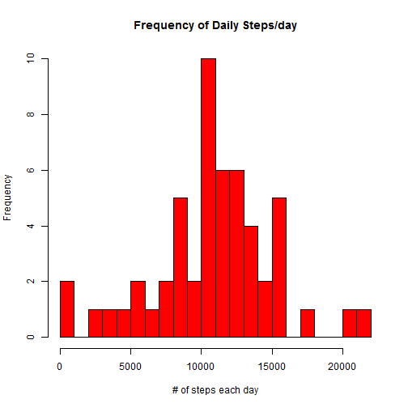
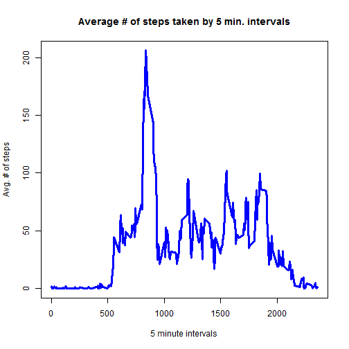
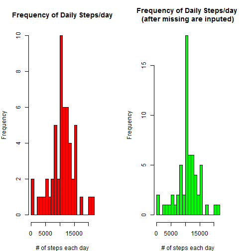

The following document analyzes a given dataset from one of many applications whcih track workout activities of individuals. This analysis is part of Assignment 1 for the Reproducible Research course from Johns Hopkins University's Data Scientist certification.

###Loading and preprocessing the data

First load the necessary file for the analysis.

```r
file<-read.csv("C:/Users/S S/Dropbox/Cousera/Reproducible Research/repdata-data-activity/activity.csv", header = T)
```

Lets review how the data are in the file.

```r
head(file)
```

```
##   steps       date interval
## 1    NA 2012-10-01        0
## 2    NA 2012-10-01        5
## 3    NA 2012-10-01       10
## 4    NA 2012-10-01       15
## 5    NA 2012-10-01       20
## 6    NA 2012-10-01       25
```
It's time to make some important updates. Start by updating the vectors in the "file" object to an appropriate class.

```r
file$date<-as.Date(file$date,format = "%Y-%m-%d")
file$steps<-as.numeric(file$steps)
```
There are several NA values. For the first analysis, remove those records.

```r
clean_data<-na.omit(file)
```
###What is mean total number of steps taken per day?
For part 1, a histogram helps to summarize the total number of steps taken by an individual each day. The 'plyr' package is used to prep the data.


```r
day<-ddply(clean_data, "date", summarise, sum(steps))
names(day)<-c("date", "steps")
hist(day$steps, breaks = 25, main = "Frequency of Daily Steps/day", xlab = "# of steps each day", col = 'red')
```

 


Use the information to find some basic measure of the data.


```r
meansteps<-mean(day$steps)
mediansteps<-median(day$steps)
```
The mean of the steps taken by an individual each day is 1.0766 &times; 10<sup>4</sup> and the median is 1.0765 &times; 10<sup>4</sup>.

###What is the average daily activity pattern?
For part 2, a time series analysis summarizes the average number of steps taken by each five minute interval. The plyr package is used to prep the data.


```r
by_day<-ddply(clean_data, "interval", summarise, round(mean(steps), 2))
names(by_day)<-c("Intervals", "Steps")
plot(by_day$Intervals, by_day$Steps, type = "l", main = "Average # of steps taken by 5 min. intervals", xlab = "5 minute intervals" , ylab = "Avg. # of steps", col = 'blue', lwd = 3)
```

 


Now find which interval, on average, has the most number of steps across all dates.

```r
max<-by_day[which.max(by_day$Steps), ]
maxinterval<-max[,1]
highsteps<-round(max[,2],2)
```

Data show the highest average steps (206.17) occur in 835th interval.

###Imputing missing values
Part 3 investigates how NA values may affect the statistical findings. First count the number of NA values in the data.

```r
no_na<-sum(is.na(file$steps))
```

In the original data, there were 2304 NA values. 

This analysis will include rows with NA values and replace the NA with the average (mean) steps taken at a matching interval. The updated data are stored in a new variable called new_file.

```r
file$steps[is.na(file$steps)]<- by_day$Steps
new_file<-file
```
Quick review of the new_file confirms that NA values are updated with actual values.

```r
head(new_file)
```

```
##   steps       date interval
## 1  1.72 2012-10-01        0
## 2  0.34 2012-10-01        5
## 3  0.13 2012-10-01       10
## 4  0.15 2012-10-01       15
## 5  0.08 2012-10-01       20
## 6  2.09 2012-10-01       25
```
Will the mean of the original data (with NA values) change with updated NA values? The following analysis to answer the question.

```r
updated<-ddply(new_file, "date", summarise, sum(steps))
names(updated)<-c("date", "steps")
updatedmeansteps<-mean(updated$steps)
updatedmediansteps<-median(updated$steps)
```

Reminder:  From data excluding NA values, 1.0766 &times; 10<sup>4</sup> was the mean of steps taken each day and 1.0765 &times; 10<sup>4</sup> was the median.

The updated data file, which uses mean values in place of NA, reports 1.0766 &times; 10<sup>4</sup> as the average # of steps taken each day. The median for the updated data is 1.0766 &times; 10<sup>4</sup>.

This analysis proves that removing NA values did not have an impact on the raw statistics. The mean and median of the two sets is identical. 

The frequency of steps change slightly, however, the overall distribution remains similar to the original (shown below graphically):


```r
par(mfcol = c(1, 2), mar = c(4, 4, 4, 4))
hist(day$steps, breaks = 25, main = "Frequency of Daily Steps/day", xlab = "# of steps each day", col = 'red')
hist(updated$steps, breaks = 25, main = "Frequency of Daily Steps/day \n(after missing are inputed)", xlab = "# of steps each day", col = 'Green')
```

 


